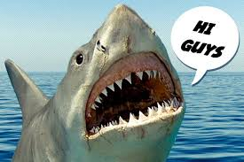

# Average victim of shark attacks WW

<!--  -->

The aim of this project is to create a profile of the average victim of a shark attack. For this task I used pandas, jupyter notebook and matplotlib for the charts.

## Sources

The database used for this report its from kaggle <a href="https://www.kaggle.com/teajay/global-shark-attacks/version/1">"Global Shark Attack Incidents"</a>, also it's included in the '''input''' folder.

## Hypothesis

Below you can find the used hypothesis for developing the profile of the average victim of a shar attack:

- Does young people suffer most of the sharks attacks?  
- Are men more affected than women for this kind of attacks?  
- Is the USA the country with the highest number of sharks attacks?  
- Are most of the sharks attacks fatal for their victims?  
- What the victim surfing when he/she was attacked?  

## Conclusion

The average victim of a shark attack is a young male of 27 years old, attacked when he was surfing in the USA and he survived to the attack. The clean data its included in a csv folder, which its located in the output folder.

## Files included

- Shark attacks.ipynb -> jupyter notebook which contain all the data cleaning and its explanations.
- requeriments.txt -> md file containing all the modules used in this app.
- src/functions.py -> auxiliary py containing the functions used to clean the dataset.
- input/GSAF5.csv -> original dataset.
- output/sharkattacks.csv -> cleaned dataset.

## Contact info

If you have any doubt please don't heisitate to contact with me:

- email : jgph91@gmail.com
- linkedin:  <a href="https://www.linkedin.com/in/javier-gomez-del-pulgar/?locale=en_US">Javier Gómez del Pulgar</a>
